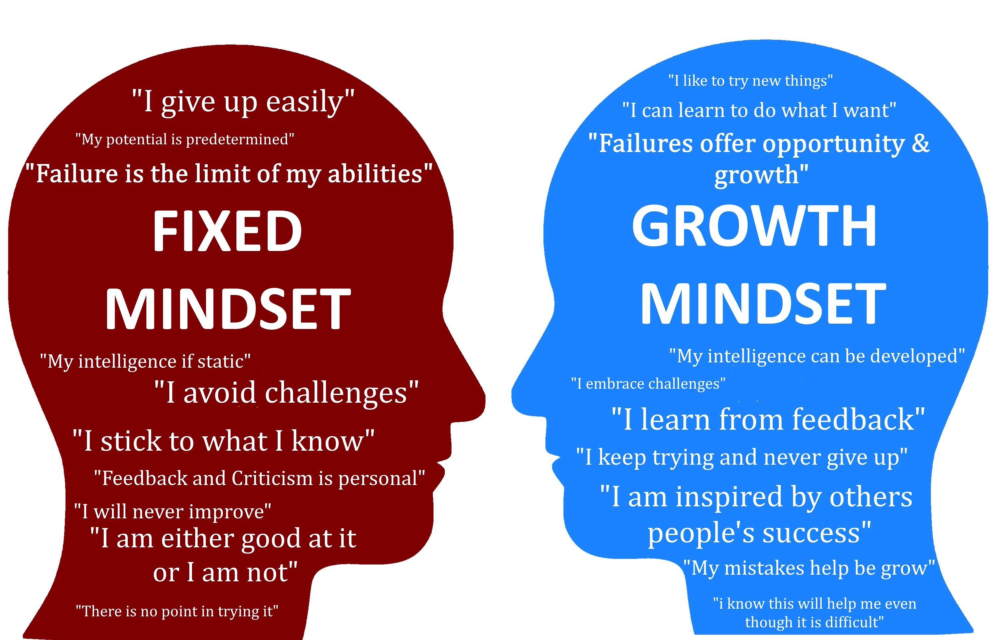

# reading-notes
## introduction

My name is mohammed mosleh iam 27 form jordan ,i have bchs of electrical engineering from university of jordan  ,iam so passionate to learn web development and be professional programmer ,I have many hobbies like chess ,football and running.

## Table of content

| file   |      link      | 
|----------|:-------------:|
| README |[link](README.md)| 
| read01 |[link](read01.md)|   
| lab01  |[link](lab01.md)| 
| read02|link| 

## growth mindset summarize
I think mindset is procedure helps programmers solving problem step by step in contrast with fixed with fixed mindest .
.
as seen in the photo growth people have qulites like:
1. patient
2. ability to under work pressure 
3. learn from his mistake

to have more information about this topic you can visit this [link](https://www.brainpickings.org/2014/01/29/carol-dweck-mindset/)
